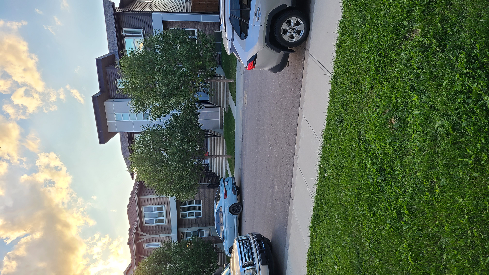
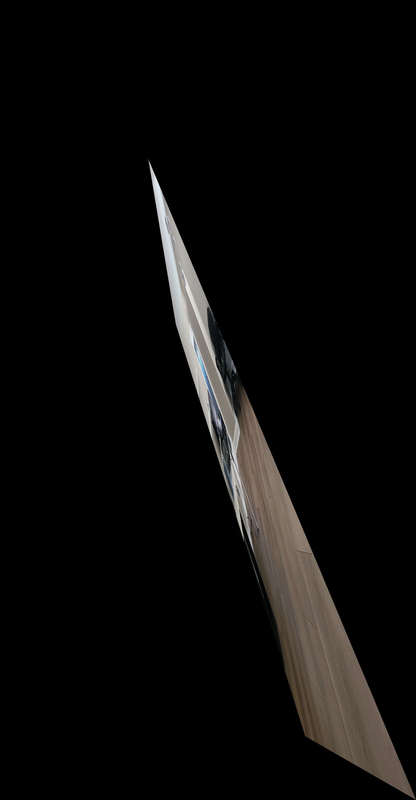

# High-Performance Image Stitching (HPIS)

## Installation and Running Instructions

Follow these steps to clone the repository, build the application, and run the main executable.

### 1. Clone the Repository
Start by cloning the project from GitHub using git:

```bash
git clone https://github.com/gayanbrahmanage/High-Performance-Image-Stiching.git

```

### 2. Navigate to the Project Directory
Change your current directory to the root of the newly cloned repository:

```
cd High-Performance-Image-Stiching
```

### 3. Run the Installation Script

Execute the install.sh script to set up the build environment and compile the project dependencies. This script should be run from the root directory:

```
bash ./install.sh
```

### 4.  Run the Application

After the build process is complete, navigate to the executable's directory and run the application. The program requires a path to the input images as an argument:

```
cd HPIS/build
./app ../../inputs/C
```

# Performance Report

## Image Specification
| Parameter          | Value      |
|-------------------|-----------|
| Image Width       | 2268 px   |
| Image Height      | 4032 px   |
| Number of Pixels  | ~9.2M     |

---

## Experiment Environment and Setup
- **Processor:** Intel Xeon E5-2699A v4 @ 2.40GHz  
- **Memory:** 16 GB  
- **Operating System:** Ubuntu 24.04.2 LTS  
- **Execution:** Single-threaded, sequential execution  
- **Note:** An uninterruptible background process was active during the experiments, which may have slightly impacted performance metrics.

### Sample Result

### Input Images

| img1.jpg | img2.jpg | img3.jpg |
|----------|----------|----------|
|  |  |  |




## Performance and Bottleneck Analysis

This section documents timing and memory usage across three test sets (A, B, C).  
Optimizations include **object reuse**, **pre-allocated buffers**, and **const references** to reduce copying and memory allocation overhead.

---

### Timing Details (ms)

| Stage           | Set A     | Set B     | Set C     |
|-----------------|-----------|-----------|-----------|
| **Image Loading** | 190.246   | 186.635   | 219.014   |
| **ORB Detection** | 461.141   | 710.966   | 1168.830  |
| **ORB Matching**  | 0.806     | 1.302     | 1.695     |
| **RANSAC**        | 7.161     | 4.083     | 5.311     |
| **Warping**       | 153.042   | 114.500   | 120.299   |


**Observations:**
- ORB detection is the primary computational bottleneck.
- Warping is significant but consistent.
- Matching and RANSAC times are negligible.

---

### Memory Usage (KB)

| Stage           | Set A     | Set B     | Set C     |
|-----------------|-----------|-----------|-----------|
| **Image Loading** | 36,376    | 34,848    | 36,088    |
| **ORB Detection** | 4,432     | 4,176     | 4,280     |
| **ORB Matching**  | 0         | 0         | 0         |
| **RANSAC**        | 0         | 0         | 0         |
| **Warping**       | 176,540   | 174,800   | 176,516   |


**Observations:**
- Warping stage dominates memory usage due to large intermediate images.
- Image loading memory is stable across test sets.
- ORB operations consume minimal memory.

---

### Key Optimizations

- Pre-allocated panorama buffers to avoid repeated allocations.
- Reuse of two image objects throughout all stitching operations.
- Use of **pointers** and **const references** to prevent unnecessary data copying.
- RANSAC early termination based on threshold to speed up outlier rejection.
- ROI-based ORB detection reduces search space and speeds up feature extraction.

---
